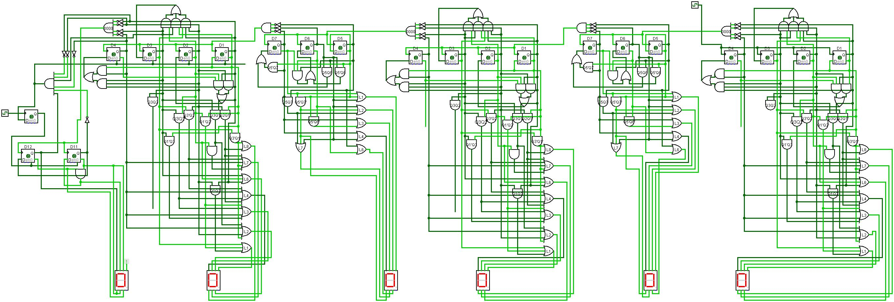

  # 7-segment Clock Circuit Created with D Flip-Flops

In this project, a clock circuit that counts from 00:00:00 to 23:59:59 has been created.

# SAAT DEVRESİ
## DÖNEM PROJESİ

### 2023-Güz

Proje kapsamında bir dijital saat devresi tasarımı yapılmıştır. Tasarımda saat ledleri (00-23), dakika ledleri (00-59) ve saniye ledleri (00-59) kullanılmıştır. Her bir led bir sayacın çıktısı olarak kabul edilip belirtilen aralık boyunca saydırma işlemi yapmıştır. Saniye 59'a geldiğinde dakikayı, dakika 59'a geldiğinde saati tetiklemiştir.
- MOD sayaçların tasarımı için durum tablosu ve bu tabloya bağlı olarak flip floplarının denklemi çıkartılmıştır.
- D flip flop kullanılmıştır.
- Sayaç çıktıları 7 segment led üzerinde gösterilmiştir.

